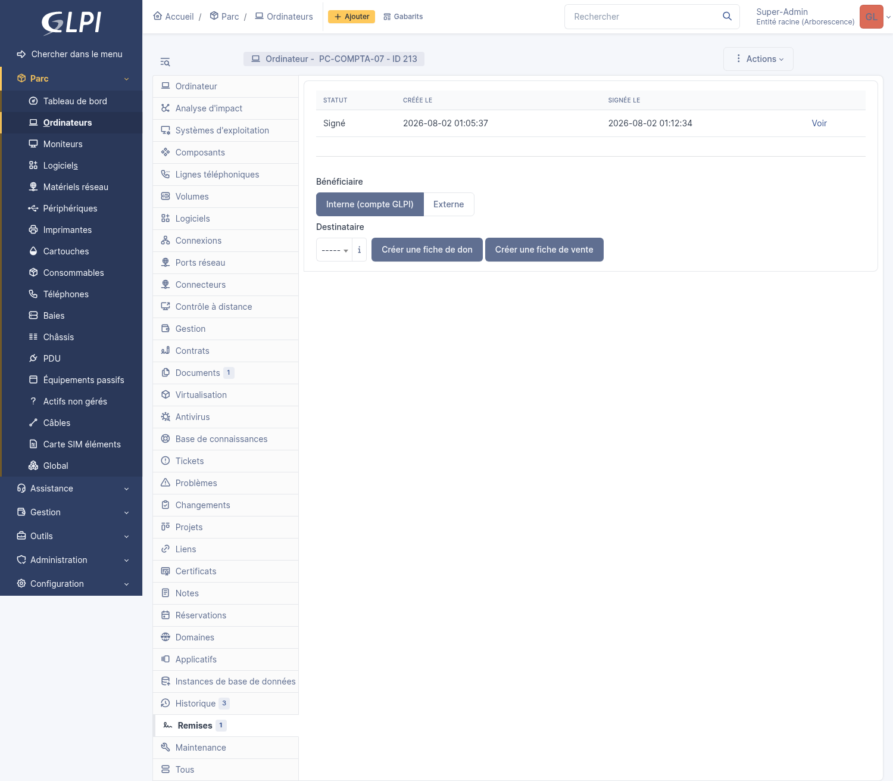
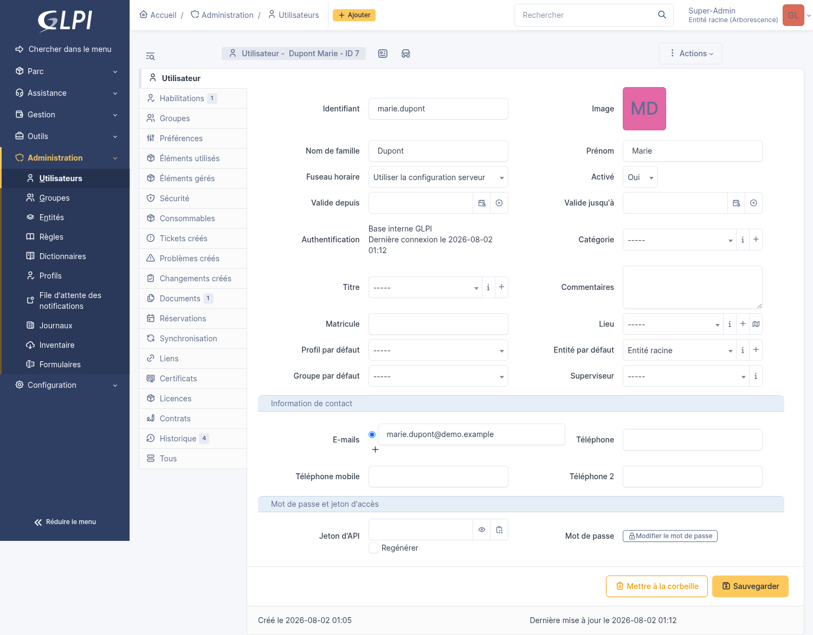

# Plugin GLPI `remise` — Remise de matériel & signature électronique

Créé par **Vincent Guillotte**, avec l'aide de [Claude Code](https://claude.com/claude-code).

## Sommaire

- [Qu'est-ce que ce plugin ?](#quest-ce-que-ce-plugin-)
- [Aperçu](#aperçu)
- [Documentation](#documentation)
- [Licence](#licence)

## Qu'est-ce que ce plugin ?

Quand un ordinateur, un écran, un téléphone ou tout autre matériel est remis à quelqu'un dans l'entreprise, il faut souvent une trace écrite : que le bénéficiaire reconnaît avoir reçu tel matériel, dans tel état, à telle date, et qu'il accepte les conditions d'usage (charte informatique, conditions générales...). En pratique, cette étape est souvent oubliée, faite sur papier et jamais archivée, ou gérée à la main dans un tableur.

Ce plugin l'automatise entièrement à partir de GLPI, l'outil que vos techniciens utilisent déjà pour gérer le parc :

1. Un technicien affecte un matériel à un utilisateur dans GLPI (comme il le fait déjà normalement).
2. Le plugin le détecte automatiquement et génère une **fiche de remise en PDF** (matériel, bénéficiaire, accessoires, conditions générales, charte informatique).
3. Le bénéficiaire reçoit un **e-mail** avec un lien vers cette fiche.
4. Il se connecte à GLPI avec son propre compte, **consulte le PDF et signe à l'écran** (souris, doigt ou stylet).
5. Le **PDF signé** est automatiquement archivé — sur la fiche du matériel *et* sur la fiche de l'utilisateur, consultable à tout moment.
6. Si le bénéficiaire ne signe pas, le plugin **relance automatiquement** puis marque le document comme expiré au bout d'un délai configurable.

Le même mécanisme fonctionne aussi en sens inverse : quand un matériel est **restitué** (désaffecté), une fiche de restitution peut être générée et signée de la même façon. Deux workflows supplémentaires existent aussi pour un Don ou une Vente de matériel — voir le [guide d'utilisation](USER_GUIDE.md) pour le détail complet des fonctionnalités.

**Sécurité** : la page de signature n'est jamais accessible par un simple lien anonyme — il faut être connecté à GLPI, et le lien ne fonctionne que pour le bénéficiaire réel du document. Un autre utilisateur authentifié qui obtiendrait le lien par erreur (transfert d'e-mail, etc.) se voit refuser l'accès.

> Ce plugin a été conçu et **validé de bout en bout** dans un environnement GLPI réel (Docker) : affectation → détection → génération PDF → e-mail → connexion → consultation → signature → rattachement — chaque étape a été testée avec de vraies requêtes contre une instance GLPI, y compris les cas de refus d'accès.

## Aperçu

**Le paramétrage, organisé par onglet, avec aperçu du PDF en direct** (avant même d'enregistrer) :

**La fiche d'une remise, côté technicien** — statut, observations, état des lieux visuel avec repères de dommage, accessoires remis :

**La page de signature, côté bénéficiaire** — consultation du PDF, état des lieux visuel, remarque libre, signature à l'écran :

**Le PDF généré**, identique à ce que l'aperçu en direct affichait déjà avant signature :

**Une fiche de maintenance interne**, avec un type de saisie propre à chaque point de contrôle (case à cocher, texte libre, menu déroulant) :

### Les intitulés (Configuration > Intitulés)

Trois listes déroulantes configurables par l'administrateur apparaissent comme n'importe quel autre intitulé natif de GLPI (Configuration > Intitulés), sans écran séparé à connaître :

**Accessoires de remise** — le catalogue proposé lors de l'ajout d'un accessoire sur une fiche (chargeur, sacoche, souris...) :

**Gabarits de remise** — un gabarit par type de fiche (Remise/Restitution/Don/Vente), avec son propre texte de conditions générales et son statut par défaut :

**Points de contrôle de maintenance** — chaque point définit son propre type de saisie (case à cocher, texte libre, ou menu déroulant avec ses propres options), configuré directement depuis cette liste :

### Les listes transverses (Outils > Remises / Fiches de maintenance)

**Outils > Remises ("Gestion des fiches")** : toutes les remises/restitutions/dons/ventes de tout le parc, quel que soit le matériel ou le bénéficiaire, avec téléchargement direct des PDF (non signé et signé) et annulation en action groupée. Cette liste sert de tableau de bord central pour le technicien qui n'a pas besoin de rouvrir chaque fiche matériel une par une :

**Outils > Fiches de maintenance** : la même logique, mais pour les fiches de maintenance internes (sans bénéficiaire ni signature) — un second point d'entrée vers la même liste que l'onglet Maintenance d'un matériel donné :

### L'onglet « Remises » sur la fiche d'un matériel

Chaque matériel géré par le plugin (ordinateur, écran, périphérique, téléphone, ou un actif personnalisé) gagne un onglet **Remises** dans son menu latéral, à côté des onglets natifs de GLPI. Il liste l'historique des remises déjà faites sur ce matériel, et propose un formulaire de création manuelle pour un Don ou une Vente — avec le choix entre un bénéficiaire interne (un compte GLPI existant, via le menu déroulant) ou externe (nom et contact en texte libre, pour une personne ou une association sans compte GLPI) :

Une fois une remise signée, la même fiche affiche son statut, ses dates, et le bénéficiaire réel :

### L'onglet « Maintenance » sur la fiche d'un matériel

Un second onglet dédié, indépendant des remises signées (pas de bénéficiaire, pas de signature), avec le formulaire de nouvelle fiche de maintenance directement accessible — chaque point de contrôle affiche son propre type de saisie (case à cocher, champ texte, menu déroulant) tel que défini dans Intitulés :

### L'onglet « Remises » sur la fiche d'un utilisateur

Le même onglet Remises existe aussi côté utilisateur (fiche d'un compte GLPI, Administration > Utilisateurs) : pratique pour retrouver d'un coup d'œil tout ce qu'une personne a reçu, sans avoir à connaître à l'avance sur quel matériel chercher :

## Documentation

| Document | Pour qui / pour quoi |
|---|---|
| **[INSTALLATION.md](INSTALLATION.md)** | Prérequis, installation, premier réglage, mise à jour du plugin. |
| **[USER_GUIDE.md](USER_GUIDE.md)** | Utilisation au quotidien : fonctionnement détaillé, liste complète des fonctionnalités, tableau de bord, FAQ. |
| **[ARCHITECTURE.md](ARCHITECTURE.md)** | Pour les développeurs : structure du code, sous-systèmes, sécurité du dépôt, suite de tests automatisés. |
| **[TROUBLESHOOTING.md](TROUBLESHOOTING.md)** | Pièges rencontrés et décisions non évidentes prises en conditions réelles. |
| **[CONTRIBUTING.md](CONTRIBUTING.md)** | Workflow de contribution, vérifications avant de pousser, comment publier une release. |
| **[ROADMAP.md](ROADMAP.md)** | Ce qui est envisagé, pas encore engagé sur une date précise. |
| **[SECURITY.md](SECURITY.md)** | Comment signaler une vulnérabilité. |

## Licence

GPL-2.0-or-later, conformément aux conventions des plugins GLPI.
