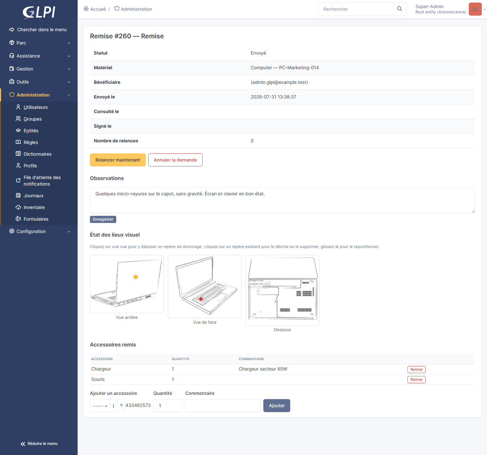
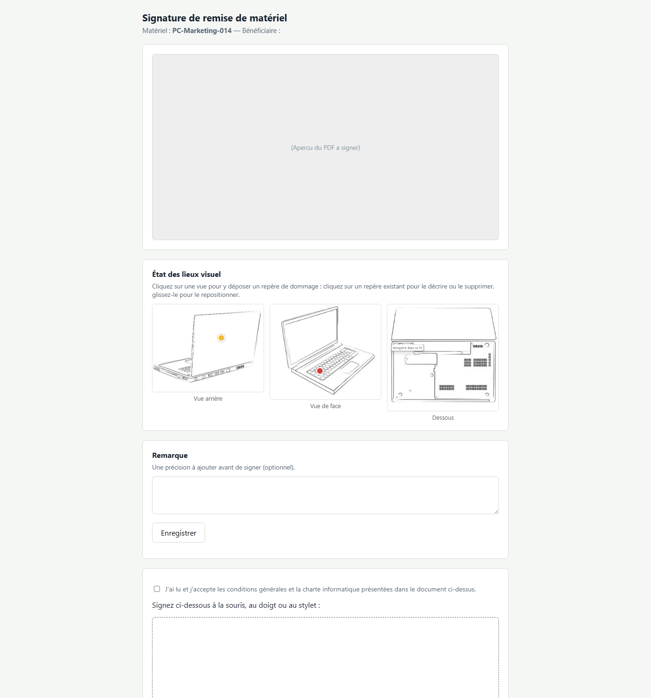

# Plugin GLPI `remise` — Remise de matériel & signature électronique

Créé par **Vincent Guillotte**, avec l'aide de [Claude Code](https://claude.com/claude-code).

## Sommaire

- [Qu'est-ce que ce plugin ?](#quest-ce-que-ce-plugin-)
- [Aperçu](#aperçu)
- [Documentation](#documentation)
- [Licence](#licence)

## Qu'est-ce que ce plugin ?

Quand un ordinateur, un écran, un téléphone ou tout autre matériel est remis à quelqu'un dans l'entreprise, il faut souvent une trace écrite : que le bénéficiaire reconnaît avoir reçu tel matériel, dans tel état, à telle date, et qu'il accepte les conditions d'usage (charte informatique, conditions générales...). En pratique, cette étape est souvent oubliée, faite sur papier et jamais archivée, ou gérée à la main dans un tableur.

Ce plugin l'automatise entièrement à partir de GLPI, l'outil que vos techniciens utilisent déjà pour gérer le parc :

1. Un technicien affecte un matériel à un utilisateur dans GLPI (comme il le fait déjà normalement).
2. Le plugin le détecte automatiquement et génère une **fiche de remise en PDF** (matériel, bénéficiaire, accessoires, conditions générales, charte informatique).
3. Le bénéficiaire reçoit un **e-mail** avec un lien vers cette fiche.
4. Il se connecte à GLPI avec son propre compte, **consulte le PDF et signe à l'écran** (souris, doigt ou stylet).
5. Le **PDF signé** est automatiquement archivé — sur la fiche du matériel *et* sur la fiche de l'utilisateur, consultable à tout moment.
6. Si le bénéficiaire ne signe pas, le plugin **relance automatiquement** puis marque le document comme expiré au bout d'un délai configurable.

Le même mécanisme fonctionne aussi en sens inverse : quand un matériel est **restitué** (désaffecté), une fiche de restitution peut être générée et signée de la même façon. Deux workflows supplémentaires existent aussi pour un Don ou une Vente de matériel — voir le [guide d'utilisation](USER_GUIDE.md) pour le détail complet des fonctionnalités.

**Sécurité** : la page de signature n'est jamais accessible par un simple lien anonyme — il faut être connecté à GLPI, et le lien ne fonctionne que pour le bénéficiaire réel du document. Un autre utilisateur authentifié qui obtiendrait le lien par erreur (transfert d'e-mail, etc.) se voit refuser l'accès.

> Ce plugin a été conçu et **validé de bout en bout** dans un environnement GLPI réel (Docker) : affectation → détection → génération PDF → e-mail → connexion → consultation → signature → rattachement — chaque étape a été testée avec de vraies requêtes contre une instance GLPI, y compris les cas de refus d'accès.

## Aperçu

**La fiche d'une remise, côté technicien** — statut, observations, état des lieux visuel avec repères de dommage, accessoires remis :

**La page de signature, côté bénéficiaire** — consultation du PDF, état des lieux visuel, remarque libre, signature à l'écran :

Toutes les autres captures d'écran (paramétrage, tableau de bord, listes, onglets, Intitulés...) sont dans le [guide d'utilisation](USER_GUIDE.md#aperçu).

## Documentation

| Document | Pour qui / pour quoi |
|---|---|
| **[INSTALLATION.md](INSTALLATION.md)** | Prérequis, installation, premier réglage, mise à jour du plugin. |
| **[USER_GUIDE.md](USER_GUIDE.md)** | Utilisation au quotidien : fonctionnement détaillé, liste complète des fonctionnalités, tableau de bord, FAQ. |
| **[ARCHITECTURE.md](ARCHITECTURE.md)** | Pour les développeurs : structure du code, sous-systèmes, sécurité du dépôt, suite de tests automatisés. |
| **[TROUBLESHOOTING.md](TROUBLESHOOTING.md)** | Pièges rencontrés et décisions non évidentes prises en conditions réelles. |
| **[CONTRIBUTING.md](CONTRIBUTING.md)** | Workflow de contribution, vérifications avant de pousser, comment publier une release. |
| **[ROADMAP.md](ROADMAP.md)** | Ce qui est envisagé, pas encore engagé sur une date précise. |
| **[SECURITY.md](SECURITY.md)** | Comment signaler une vulnérabilité. |
| **[CHANGELOG.md](CHANGELOG.md)** | Historique des versions publiées. |

## Licence

[GPL-3.0-only](LICENSE), conformément aux conventions des plugins GLPI.
