# Guide d'utilisation

Ce guide suppose le plugin déjà installé et configuré — voir [INSTALLATION.md](INSTALLATION.md) sinon.

## Comment ça marche, vu par chaque personne

**L'administrateur** configure une fois pour toutes (Configuration > AssetSign) : quels types de matériel sont concernés, quand une signature est déclenchée (affectation, réaffectation, restitution, ou changement d'État), les délais de relance, le logo et la charte à afficher sur les PDF.

**Le technicien** n'a rien de spécial à faire : il continue d'affecter le matériel dans GLPI comme d'habitude. Le plugin se charge du reste. Il peut consulter à tout moment l'historique des remises (menu Administration > AssetSign > Assetsigns) et relancer manuellement un bénéficiaire qui n'a pas encore signé.

**Le bénéficiaire** reçoit un e-mail, clique sur le lien, se connecte à GLPI s'il ne l'est pas déjà, relit le document et signe à l'écran. Une fois signé, il retrouve le PDF signé dans l'onglet Documents de son profil.

## Aperçu

**Le paramétrage, organisé par onglet, avec aperçu du PDF en direct** (avant même d'enregistrer) — voir [INSTALLATION.md](INSTALLATION.md#3-configurer) pour le détail des réglages :

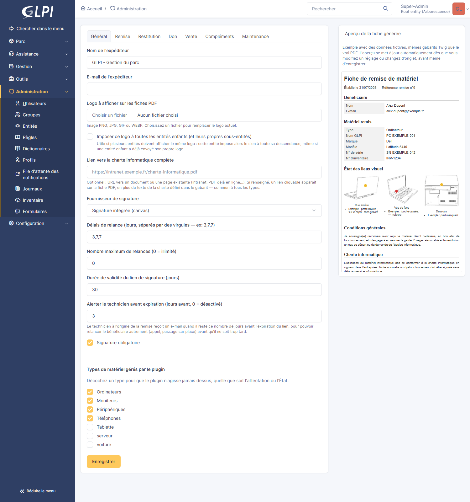

**Le PDF généré**, identique à ce que l'aperçu en direct affichait déjà avant signature :

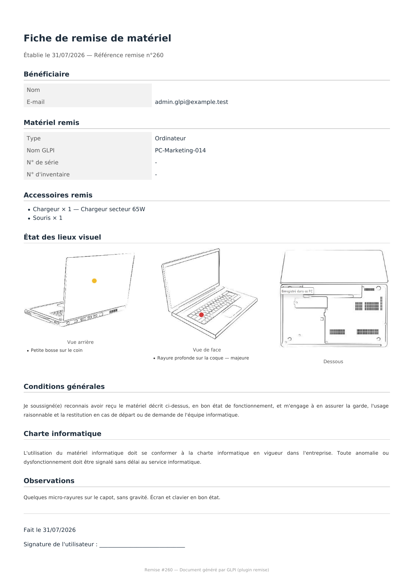

**Une fiche de maintenance interne**, avec un type de saisie propre à chaque point de contrôle (case à cocher, texte libre, menu déroulant) :

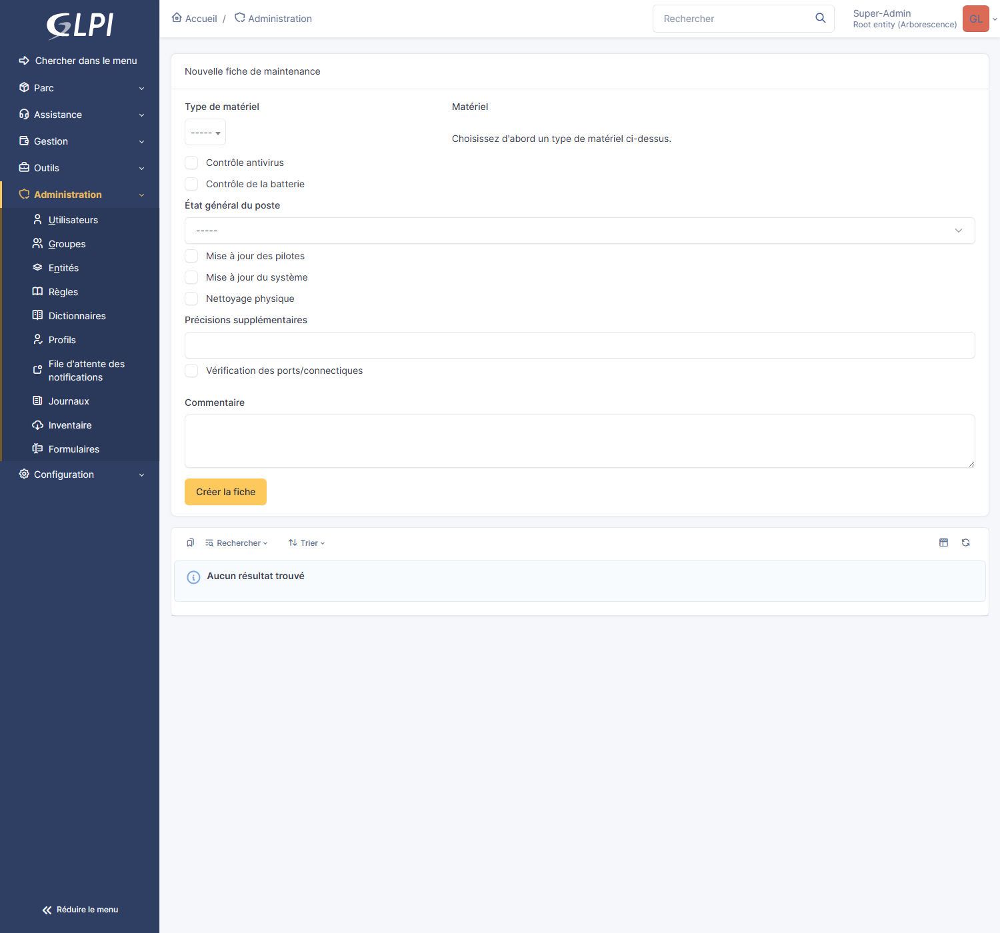

### Les intitulés (Configuration > Intitulés)

Trois listes déroulantes configurables par l'administrateur apparaissent comme n'importe quel autre intitulé natif de GLPI (Configuration > Intitulés), sans écran séparé à connaître :

**Accessoires de remise** — le catalogue proposé lors de l'ajout d'un accessoire sur une fiche (chargeur, sacoche, souris...) :

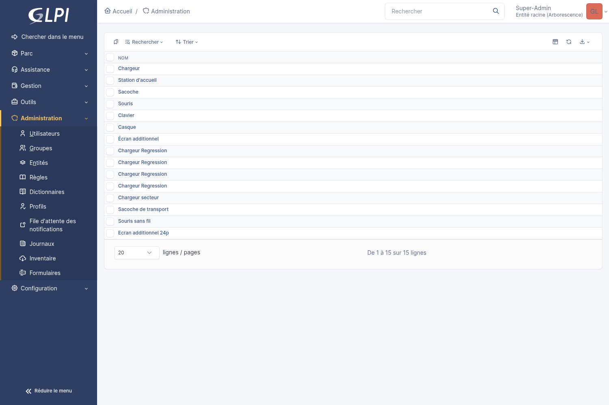

**Gabarits de remise** — un gabarit par type de fiche (Remise/Restitution/Don/Vente), avec son propre texte de conditions générales et son statut par défaut. Le gabarit par défaut de chaque type s'édite directement depuis l'onglet correspondant de Configuration > AssetSign (voir plus bas) — cette liste reste utile pour gérer plusieurs gabarits par type/entité au-delà du seul gabarit par défaut :

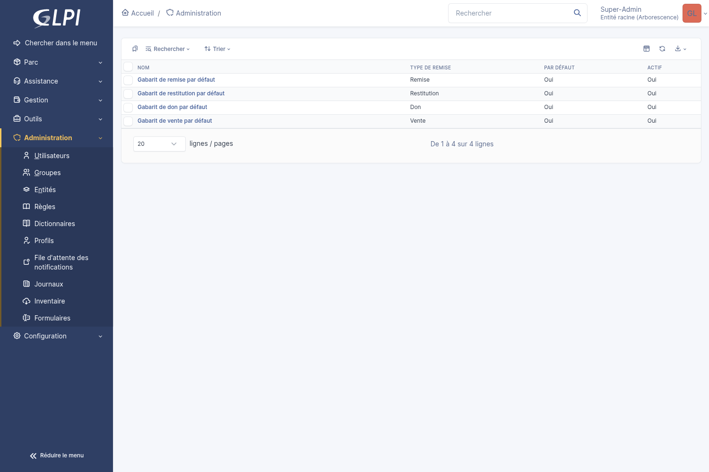

**Points de contrôle de maintenance** — chaque point définit son propre type de saisie (case à cocher, texte libre, ou menu déroulant avec ses propres options), configuré directement depuis cette liste :

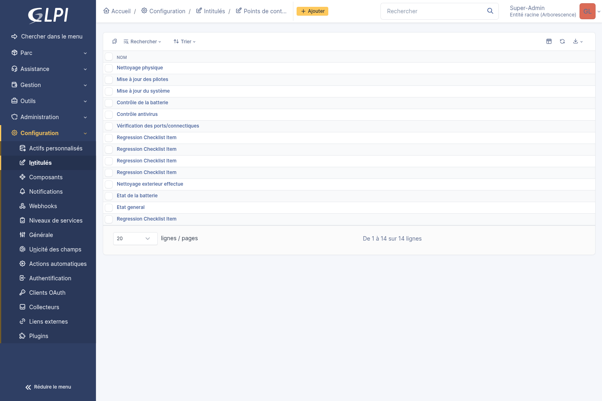

### Les listes transverses (Outils > Assetsigns / Fiches de maintenance)

**Outils > Assetsigns ("Gestion des fiches")** : toutes les remises/restitutions/dons/ventes de tout le parc, quel que soit le matériel ou le bénéficiaire, avec téléchargement direct des PDF (non signé et signé) et annulation en action groupée. Cette liste sert de tableau de bord central pour le technicien qui n'a pas besoin de rouvrir chaque fiche matériel une par une :

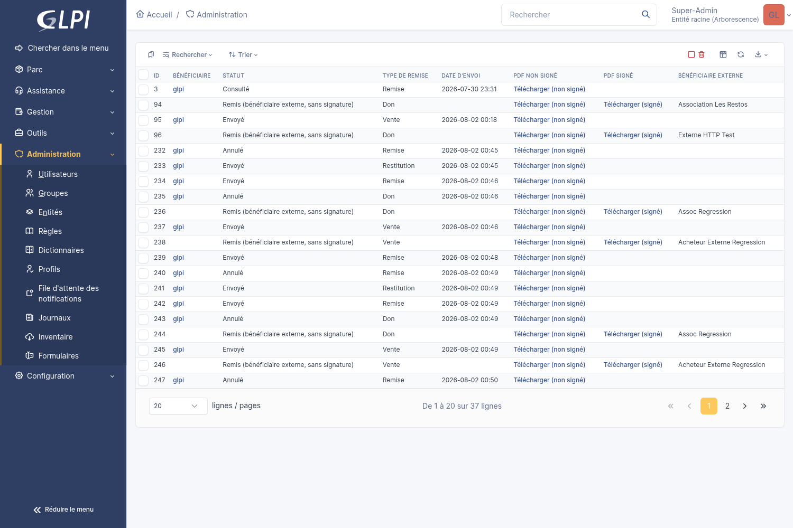

**Outils > Fiches de maintenance** : la même logique, mais pour les fiches de maintenance internes (sans bénéficiaire, avec un PDF téléchargeable systématique et une signature du technicien optionnelle, cf. plus bas) — un second point d'entrée vers la même liste que l'onglet Maintenance d'un matériel donné :

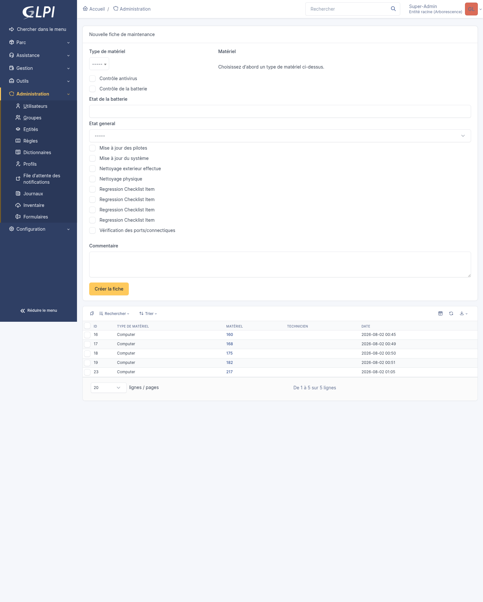

### L'onglet « Assetsigns » sur la fiche d'un matériel

Chaque matériel géré par le plugin (ordinateur, écran, périphérique, téléphone, ou un actif personnalisé) gagne un onglet **Assetsigns** dans son menu latéral, à côté des onglets natifs de GLPI. Il liste l'historique des remises déjà faites sur ce matériel — avec, pour chaque ligne, un lien de téléchargement direct du PDF (non signé et/ou signé selon l'avancement) sans avoir à ouvrir la fiche — et propose un formulaire de création manuelle pour un Don ou une Vente — avec le choix entre un bénéficiaire interne (un compte GLPI existant, via le menu déroulant) ou externe (nom et contact en texte libre, pour une personne ou une association sans compte GLPI) :

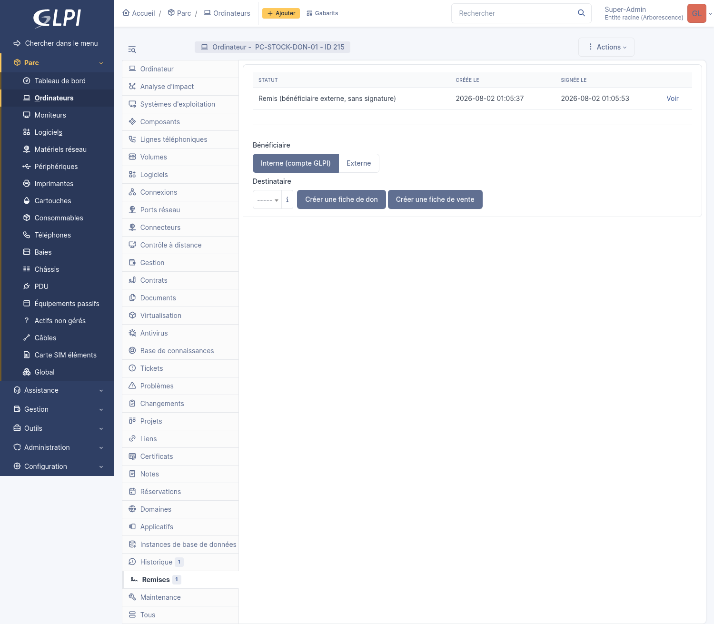

Une fois une remise signée, la même fiche affiche son statut, ses dates, et le bénéficiaire réel :


### L'onglet « Maintenance » sur la fiche d'un matériel

Un second onglet dédié, indépendant des remises signées (pas de bénéficiaire, pas de jeton, pas d'e-mail), avec le formulaire de nouvelle fiche de maintenance directement accessible — chaque point de contrôle affiche son propre type de saisie (case à cocher, champ texte, menu déroulant) tel que défini dans Intitulés. Une fois créée, la fiche génère toujours un PDF téléchargeable (même mise en page que les fiches remise/don/vente, avec le logo de l'entité) ; si l'administrateur a activé la signature du technicien (Configuration > AssetSign > Maintenance), un pavé de signature apparaît sur ce même formulaire et doit être rempli avant de pouvoir créer la fiche — sans jeton ni e-mail, le technicien étant déjà connecté :

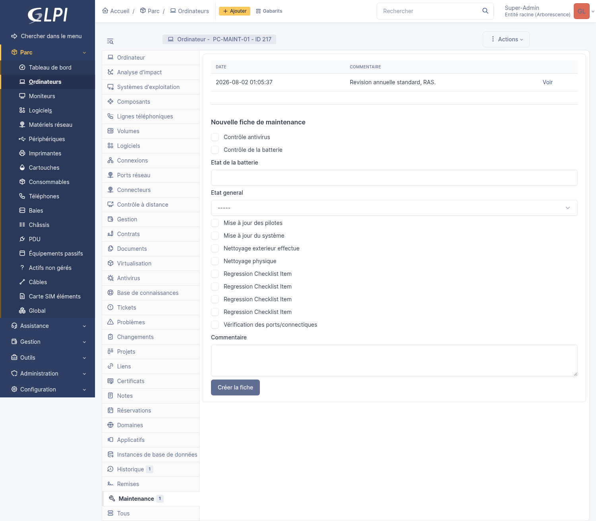

### L'onglet « Passeport matériel » sur la fiche d'un matériel

Un troisième onglet, en lecture seule, qui répond à « qui a utilisé ce matériel depuis son achat ? ». En tête, une carte de synthèse (modèle, fabricant, n° série, État, utilisateur/entité actuels, achat, fin de garantie) donne une vue d'ensemble immédiate sans avoir à dérouler toute la frise — chaque information n'apparaît que si elle est réellement renseignée. Vient ensuite une frise chronologique agrégeant automatiquement les remises, restitutions, dons, ventes et fiches de maintenance de ce matériel (rien à ressaisir, ces événements viennent des onglets ci-dessus), avec un compteur de « vies » (nombre de bénéficiaires successifs et leurs périodes). Chaque événement conserve le nom du bénéficiaire au moment où il a eu lieu, même si le compte GLPI correspondant est supprimé plus tard — ce nom peut être anonymisé après un délai configurable (Configuration > AssetSign > Passeport matériel), la date et le type d'événement restant alors seuls visibles. La fonctionnalité elle-même peut être désactivée par entité, et les types d'événement affichés dans la frise sont filtrables, depuis ce même onglet de configuration.

Pour du matériel déjà présent avant l'installation de cette fonctionnalité, la frise ne reste pas vide : à la première consultation, le plugin retrouve automatiquement dans l'historique natif de GLPI (les mêmes changements d'Utilisateur/d'État déjà utilisés pour déclencher les remises automatiques) tout ce qui s'est passé auparavant. Un bouton **« Forcer la recherche dans l'historique »** permet de relancer cette recherche à tout moment (par exemple après avoir modifié les États déclencheurs), sans jamais créer de doublon.

La frise complète aussi automatiquement les dates connues depuis l'onglet **Infocom** du matériel (achat, commande, livraison, mise en service, garantie, réforme, prix d'achat) — répond à « que s'est-il passé avant même la première attribution ? ». Rien n'est recopié : seules les dates effectivement renseignées apparaissent (un matériel sans aucune information financière/administrative n'affiche simplement rien de plus). Désactivable par entité (Configuration > AssetSign > Passeport matériel).

Les **tickets liés** au matériel apparaissent également dans la frise, en lecture seule (rien n'est recopié ni modifiable depuis cet onglet) — chaque technicien ne voit que les tickets auxquels il a réellement accès, exactement comme sur l'onglet Tickets natif du matériel. Désactivable par entité, dans le même onglet de configuration.

La carte de synthèse affiche aussi des **indicateurs temporels** : l'âge du matériel (depuis son achat si la date est connue dans Infocom, sinon depuis son entrée dans GLPI — le libellé précise toujours laquelle des deux), le temps réellement utilisé (cumul des périodes où le matériel a été attribué à quelqu'un, en pourcentage de son âge) et le temps passé en stock. La durée de chaque « vie » (période d'attribution à une même personne) est également affichée directement dans la liste.

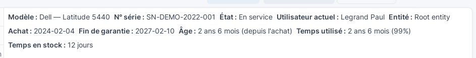

Un **score de santé** (0 à 100, 100 = état idéal) est calculé à partir de quatre facteurs : l'âge, le nombre de tickets liés (incidents), l'état physique (marqueurs de dégât relevés lors des états des lieux) et le nombre de changements de détenteur. Le détail du calcul (pourcentage de dégradation par facteur) est affiché sous le score :


L'importance de chaque facteur se règle dans Configuration > AssetSign > Passeport matériel : les poids sont **relatifs** (pas besoin de les faire sommer à 100 exactement), et mettre un poids à 0 désactive simplement ce facteur. Le score peut aussi être désactivé entièrement.

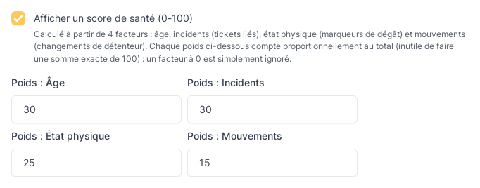

### L'onglet « Assetsigns » sur la fiche d'un utilisateur

Le même onglet Assetsigns existe aussi côté utilisateur (fiche d'un compte GLPI, Administration > Utilisateurs) — filtré cette fois par bénéficiaire plutôt que par matériel, avec une colonne supplémentaire indiquant à quel matériel chaque ligne correspond (une même personne ayant pu recevoir plusieurs matériels différents dans le temps) : pratique pour retrouver d'un coup d'œil tout ce qu'une personne a reçu, télécharger directement chaque PDF, sans avoir à connaître à l'avance sur quel matériel chercher. Un raccourci **"Assigner un matériel à cet utilisateur"** permet en plus d'affecter directement un matériel depuis cet écran (choix du type puis du matériel) — l'affectation déclenche automatiquement la création d'une remise, exactement comme changer le champ "Utilisateur" depuis la fiche du matériel :


### L'onglet « Passeport utilisateur » sur la fiche d'un utilisateur

Vue symétrique du Passeport matériel : une frise chronologique de tout ce qu'une personne a reçu, rendu, donné ou acheté, de son entrée dans l'entreprise à sa désactivation/suppression. Chaque ligne indique le nom et le numéro de série du matériel concerné (repli explicite si l'un des deux manque, par exemple un matériel supprimé depuis) et renvoie vers la fiche d'origine. Comme pour le Passeport matériel, l'historique antérieur à l'installation de cette fonctionnalité est retrouvé automatiquement (même bouton « Forcer la recherche dans l'historique » disponible ici, sur l'ensemble du matériel déjà eu par cette personne).

## Fonctionnalités

- Détection automatique de l'affectation/réaffectation/restitution d'un matériel, sans action manuelle du technicien.
- Génération PDF (fiche de remise ou de restitution) avec gabarits personnalisables (conditions générales, charte informatique) — un nouveau gabarit part d'un texte par défaut modifiable plutôt que d'un champ vide. Variables disponibles dans ce texte libre (`{beneficiaire}`, `{technicien}`, `{materiel}`, `{date}`, `{entite}`), remplacées automatiquement sur le PDF : un seul gabarit rédigé une fois plutôt qu'une variante par cas.
- Signature à l'écran intégrée (aucun service externe requis, aucun coût de licence) — souris, doigt ou stylet, avec prévisualisation du PDF avant de signer.
- Relances automatiques en cas d'inaction, avec limite de nombre configurable, puis expiration automatique du lien passé un certain délai.
- Relance manuelle à tout moment depuis la fiche d'une remise, ou en action groupée sur plusieurs remises sélectionnées depuis la liste (Administration > AssetSign > Assetsigns).
- Alerte au technicien quelques jours avant l'expiration réelle du lien (configurable par entité, désactivable) — pour pouvoir relancer le bénéficiaire autrement (appel, passage sur place) avant qu'il ne soit trop tard, plutôt que d'apprendre l'inaction une fois le lien déjà expiré.
- Rattachement automatique du PDF signé au matériel *et* à l'utilisateur (onglet Documents natif de GLPI).
- Preuve de signature consultable directement sur la fiche de chaque remise signée (menu Administration > AssetSign > Assetsigns) : signataire, adresse IP, navigateur, empreinte SHA-256 du document — utile en cas de contestation, sans avoir à rouvrir le PDF pour retrouver ces informations.
- Historique complet et horodaté de chaque remise, avec preuve de signature (adresse IP, date/heure, empreinte du document).
- Accessoires remis (chargeur, sacoche, écran additionnel...) : catalogue configurable, associable à chaque remise avec quantité et commentaire.
- Marque et modèle du matériel affichés automatiquement sur le PDF quand l'information existe dans GLPI.
- Logo de l'entreprise personnalisable par simple envoi de fichier depuis le poste de l'administrateur — aperçu en direct du rendu final avant même d'enregistrer. Utile pour un GLPI partagé entre plusieurs sociétés/marques : chaque entité peut avoir son propre logo, et une entité (ex. la racine, ou une filiale) peut cocher « Imposer ce logo à toutes les entités enfants » pour forcer le même logo sur toute sa descendance, y compris les sous-entités de ses entités enfants — même si celles-ci ont déjà envoyé leur propre logo.
- Lien vers la charte informatique complète configurable par entité (utile si plusieurs sociétés/sites hébergent leur charte à des endroits différents), en plus d'un texte de charte propre à chaque gabarit.
- Fonctionne avec les **actifs personnalisés** créés dans GLPI (Configuration > Actifs personnalisés), en plus des types standards (ordinateurs, écrans, périphériques, téléphones) — aucune modification du plugin nécessaire.
- Configuration indépendante par entité, avec héritage automatique (une entité sans réglage propre hérite de celui de son entité parente la plus proche).
- Interface disponible en français, anglais, espagnol, allemand et italien (détectée automatiquement selon la langue du compte GLPI du destinataire pour les e-mails).
- Tableau de bord GLPI natif : voir la section [Tableau de bord](#tableau-de-bord) ci-dessous.
- Menu dédié **Administration > AssetSign > Gestion des fiches** : vue transverse de toutes les remises/restitutions (tous matériels et bénéficiaires confondus), avec téléchargement direct du PDF (non signé et signé) et annulation d'une ou plusieurs demandes en attente (individuellement ou en action groupée).
- Conditions générales et charte informatique activables **indépendamment** sur chaque gabarit (deux cases à cocher) : un gabarit peut par exemple n'afficher que la charte, ou aucune des deux sections, sans avoir à vider le texte.
- Bouton « Retour à l'accueil GLPI » proposé au bénéficiaire une fois sa signature enregistrée (et sur l'écran d'erreur d'un lien invalide/expiré), pour ne pas le laisser sur une page sans issue.
- Objet et corps des e-mails adaptés automatiquement au type de fiche (remise ou restitution) via la balise `##remise.type##` — un seul jeu de notifications pour tous les types, au lieu d'un texte figé qui parlait toujours de « remise » même pour une restitution.
- Champ « Observations » libre et optionnel (désactivé par défaut, activable par entité) : permet de noter un état constaté du matériel, repris sur le PDF tant que la fiche n'est pas signée.
- **Don de matériel** et **Vente de matériel** : deux workflows supplémentaires, désactivables par entité, déclenchables soit manuellement depuis l'onglet Remise d'un matériel (boutons dédiés « Créer une fiche de don »/« Créer une fiche de vente »), soit **automatiquement par changement d'État** (comme Remise/Restitution), au choix de l'administrateur parmi ses propres États. La Vente ajoute un prix et une date de vente, repris sur le PDF dès qu'ils sont renseignés — quand la Vente est déclenchée automatiquement (prix inconnu à cet instant), la fiche n'y fait simplement pas encore référence, et le prix/la date restent modifiables après coup depuis la fiche.
- **Bénéficiaire interne ou externe** (Don/Vente uniquement) : la création manuelle propose un choix — un compte GLPI existant (workflow signé habituel, e-mail + signature à l'écran), ou une personne/organisation **externe à l'entreprise** (nom et contact en texte libre, aucune signature électronique requise puisqu'un tiers sans compte GLPI ne peut pas se connecter pour signer — le PDF généré fait alors directement foi). Si un changement d'État déclenche automatiquement un don/une vente sur un matériel **sans utilisateur assigné** (aucun bénéficiaire interne connu), le plugin ne peut rien créer tout seul mais affiche un message invitant à créer la fiche manuellement avec le bon bénéficiaire.
- **État des lieux visuel** (désactivable par entité) : 3 vues de référence (arrière, avant, dessous) toujours affichées sur la fiche dès que le réglage est actif — un technicien (depuis la fiche admin) **ou le bénéficiaire lui-même (depuis sa page de signature, avant de signer)** peut cliquer dessus pour déposer un repère, avec description et gravité optionnelles, repris sur le PDF.
- **Remarque libre du bénéficiaire** : un champ texte optionnel sur la page de signature, que le bénéficiaire remplit lui-même avant de signer (ex. signaler un souci constaté à la réception) — repris sur le PDF sous "Remarque du bénéficiaire", et visible en lecture seule sur la fiche admin.
- **Fiches de maintenance/préparation** : formulaire interne (sans bénéficiaire, sans jeton, sans e-mail) avec une checklist de points de contrôle entièrement configurable par l'administrateur (Configuration > Intitulés) et un commentaire libre — accessible depuis l'onglet Maintenance de chaque matériel *et* directement depuis la liste des fiches (Outils > Fiches de maintenance > Nouvelle fiche, avec sélection du matériel). Chaque point de contrôle définit son propre **type de saisie** (case à cocher, texte libre, ou menu déroulant avec des options définies par l'administrateur) — pas seulement des cases à cocher. **État des lieux visuel disponible aussi sur ces fiches** (même réglage que ci-dessous) : les repères sont déposés au moment de la création (une fiche de maintenance est un constat figé, jamais modifiée après coup — contrairement à une remise, aucune fenêtre d'édition ultérieure n'est proposée), puis simplement affichés en lecture seule sur la fiche une fois créée.
- **PDF de la fiche de maintenance, toujours généré** (Configuration > AssetSign > Maintenance) : même mise en page que les fiches remise/don/vente (logo de l'entité, style identique), téléchargeable depuis la fiche, l'onglet Maintenance, ou la liste transverse. **Signature du technicien optionnelle** (case à cocher, désactivée par défaut) : si activée, un pavé de signature identique à celui d'une vente apparaît sur le formulaire de création et devient obligatoire — mais contrairement au bénéficiaire d'une remise, le technicien signe **directement sur ce même formulaire, en une seule requête** (aucun jeton, aucun e-mail, aucune page séparée, puisqu'il est déjà connecté). La preuve de signature (signataire, adresse IP, empreinte SHA-256 du PDF, horodatage) est enregistrée et consultable sur la fiche, comme pour une remise signée.
- **Aperçu du PDF en temps réel** sur les pages de configuration et de gabarit : cocher/décocher une case ou modifier un texte met à jour l'aperçu affiché, avant même d'enregistrer — rendu strictement identique au vrai PDF (mêmes gabarits Twig, mêmes données).
- **Paramétrage organisé par onglet** (Configuration > AssetSign > Configuration) : un onglet par type de fiche (Général, Remise, Restitution, Don, Vente, Compléments, Maintenance), chacun avec ses propres réglages, son aperçu, et l'édition du gabarit par défaut de ce type directement intégrée dans l'onglet — un seul formulaire, un seul enregistrement malgré la navigation par onglets.
- **Nom de l'entreprise et protection du PDF** (onglet Général) : un nom d'entreprise optionnel affiché à côté du logo sur les fiches PDF, et une case « Protéger le PDF » qui chiffre le document généré pour empêcher sa copie/modification dans un lecteur qui respecte cette restriction (la consultation et l'impression restent toujours possibles).
- **QR code optionnel sur les fiches PDF** (désactivable, onglet Compléments) : renvoie directement vers la fiche correspondante dans GLPI, pratique pour la retrouver depuis un contrôle physique du matériel.
- **Symbole monétaire personnalisable** (onglet Vente) : affiché après le prix sur le PDF (`€` par défaut, modifiable en `$`, `CHF`...) — utile pour toute organisation hors zone euro.
- **Bouton « Envoyer un e-mail de test »** (onglet Général) : vérifie que l'envoi d'e-mail fonctionne avec la configuration actuelle, sans attendre une vraie fiche à signer.
- **Suivi de version** (en tête de l'onglet Général) : compare la version installée à la dernière version publiée sur GitHub, pour repérer immédiatement un environnement resté sur une ancienne version.
- **Filigrane configurable sur l'aperçu en direct** (texte + opacité, onglet Compléments) : distingue visuellement un aperçu non enregistré d'un vrai PDF — n'apparaît jamais sur le document final.

## Ce qui n'est *pas* encore implémenté

- **Fournisseur de signature externe** pour un niveau de signature électronique renforcé (eIDAS "avancée"/"qualifiée"). Seule la signature à l'écran intégrée est disponible aujourd'hui — elle correspond à un niveau de signature électronique "simple", pas à une signature cryptographique.
- Couverture de tests automatisés : volontairement partielle aujourd'hui, à étendre au fil des évolutions (voir [ARCHITECTURE.md](ARCHITECTURE.md#tests-automatisés)).

Voir aussi [ROADMAP.md](ROADMAP.md) pour ce qui est envisagé.

## Alternative au cron GLPI

Le CronTask GLPI (**Administration > Actions automatiques** > `assetsignReminders` / `assetsignExpire` / `assetsignExpiryWarning`) est actif par défaut et suffit dans la plupart des cas.

Si vous préférez piloter ces actions depuis un ordonnanceur externe (cron système, tâche planifiée...) plutôt que de dépendre du cycle interne de GLPI, trois commandes console existent :

```bash
php bin/console plugins:assetsign:run-reminders
php bin/console plugins:assetsign:run-expiration
php bin/console plugins:assetsign:warn-expiring
```

**Si vous utilisez ces commandes depuis un ordonnanceur externe, désactivez les CronTask GLPI correspondants** pour éviter un double envoi des relances — les deux mécanismes appellent exactement la même logique, ils ne sont pas complémentaires.

## Tableau de bord

Quatre cartes natives (widgets « grand nombre ») apparaissent dans le groupe **« AssetSign »** de l'éditeur de tableau de bord GLPI (menu Tableau de bord > Modifier > Ajouter une carte) :

- Assetsigns en attente de signature
- Assetsigns signés
- Assetsigns expirés
- Échecs de création (30 derniers jours) — un échec de création automatique (rare : génération PDF, envoi du jeton...) n'interrompt jamais la sauvegarde du matériel qui l'a déclenché, mais reste sinon invisible sans consulter le fichier de log du plugin ; cette carte le rend visible d'un coup d'œil.

Chaque carte renvoie vers la liste filtrée correspondante en un clic, et respecte l'entité active sélectionnée.

## FAQ

**Un compte GLPI est-il obligatoire pour signer ?**
Oui pour un bénéficiaire interne (workflow Remise/Restitution/Don/Vente habituel). Pour Don et Vente uniquement, un bénéficiaire externe (nom/contact en texte libre, sans compte GLPI) peut être choisi lors de la création manuelle — dans ce cas, aucune signature électronique n'est demandée : le PDF généré fait directement foi.

**Que se passe-t-il si le bénéficiaire ne signe jamais ?**
Le plugin relance automatiquement jusqu'à la limite configurée, puis marque la demande comme expirée une fois le délai de validité du lien dépassé. Le technicien peut aussi relancer manuellement à tout moment avant l'expiration.

**Le lien de signature peut-il être transféré ou réutilisé par quelqu'un d'autre ?**
Non. La page de signature vérifie que l'utilisateur connecté est bien le bénéficiaire réel de cette remise précise — un autre utilisateur authentifié qui obtiendrait le lien par erreur se voit refuser l'accès. Le jeton est aussi à usage unique et se désactive après un nombre de tentatives invalides.

**Un changement de nom de l'utilisateur (mariage, divorce...) déclenche-t-il une nouvelle demande de signature ?**
Non. Seuls les changements sur le matériel lui-même (affectation, État) déclenchent une remise — modifier une fiche utilisateur n'a aucun effet sur les remises déjà signées ou en cours.

**Si je modifie la fiche d'un matériel sans toucher au champ Utilisateur ni à l'État, est-ce qu'une remise se déclenche par erreur ?**
Non. Le plugin ne réagit qu'aux changements réels des champs qu'il surveille (Utilisateur, État selon la configuration) — modifier un autre champ (nom, emplacement...) n'a aucun effet.

**Comment savoir si des échecs silencieux de création se sont produits ?**
La carte de tableau de bord « Échecs de création (30 derniers jours) » les rend visibles sans avoir à consulter les logs du plugin à la main.

**Peut-on gérer plusieurs sociétés/marques avec des logos et chartes différents ?**
Oui, via la configuration indépendante par entité avec héritage. Voir la case « Imposer ce logo à toutes les entités enfants » dans [INSTALLATION.md](INSTALLATION.md#3-configurer) pour forcer un même logo sur toute une descendance d'entités.

**Le plugin fonctionne-t-il avec mes actifs personnalisés (assets custom) ?**
Oui, automatiquement dès qu'ils sont actifs dans GLPI (Configuration > Actifs personnalisés) — aucune modification du plugin n'est nécessaire, ils apparaissent dans la liste des types de matériel gérés.
